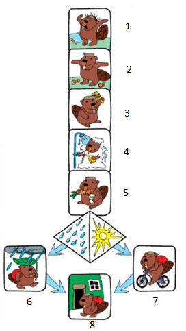
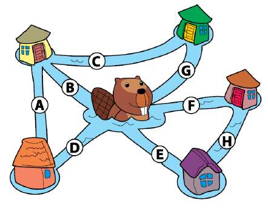
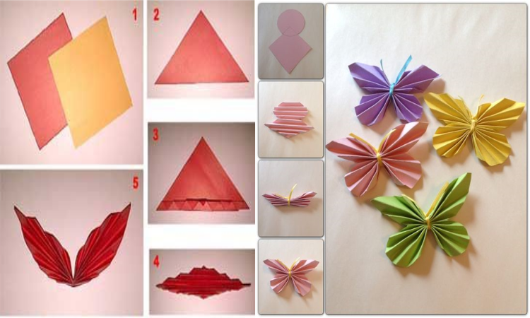
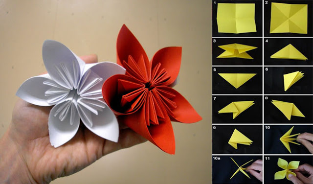

# Case Study

## Objectives

1. Students can create model from sequence case study problems.
2. Students can create model from conditional case study problems.
3. Students can create model from looping case study problems.

## Overview

Algorithm is set of logical steps for solving a problem. The procedure can be
given in the form of a collection of instructions called programs. The program
is written in programming language. A program is arranged systematically, the
steps must be clear. Besides that a program must be logical and acceptable.

* Input: lorem ipsum
* Output: lorem ipsum
* Definiteness: lorem ipsum
* Finiteness: lorem ipsum
* Effectiveness: lorem ipsum

## Practice
### Practice 1: Solve Sequence Case Study

Gabrielle do routine activities based on the picture.

However, there are 2 activities that are not in the right order. How is the
correct order?

### Practice 2: Solve Conditional Case Study

### Practice 3: Solve Looping Case Study

## Tasks

1. Create ornament from the paper (anything paper, not only color paper). You
   can create free ornament. Write your algorithm with input (additional data),
   process and output format. Take a picture of your ornament and attach it on
   report then collect into your lecturer.

   
   
