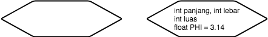
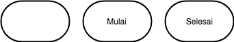
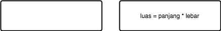
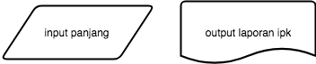
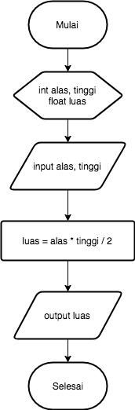
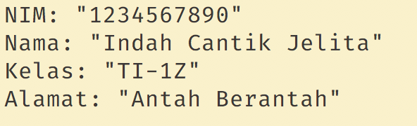
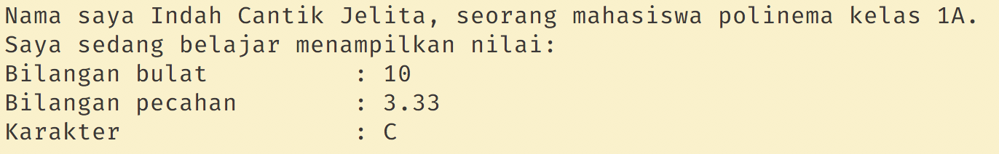
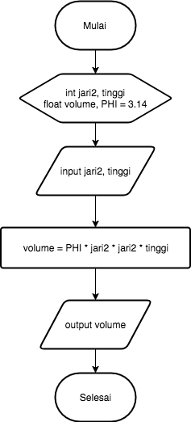

# Jobsheet 3 - Syntax

## Tujuan
1. Mahasiswa memahami sintaks dasar bahasa pemrograman Java
2. Mahasiswa mampu mengimplementasikan tipe data, variabel, input-output ke
   dalam program bahasa Java.
3. Mahasiswa memahami konsep alur kontrol sequence pada program.

## Alat dan Bahan
1. PC/Laptop
2. Text Editor (Sublime Text, VSCode, Notepad++)
3. JDK

## Ulasan Materi

### Syntax

Dalam membuat sebuah program, kita harus mengikut struktur dasar dari bahasa
pemrograman. Ada beberapa komponen yang hampir selalu muncul setiap kali kita
membuat program bahasa Java. Komponen-komponen tersebut antara lain:

1. Deklarasi `class`.
2. Fungsi `main()`
3. Deklarasi variabel.
4. Perintah (statement).
5. Keyword `import`.
6. Komentar
7. Kurung kurawal

Berikut adalah contoh kode program beserta penjelasan strukturnya:

```java
// semua baris yang diawali dengan tanda // adalah komentar

// import untuk menyertakan fungsi-fungsi dari sebuah library
import java.util.Scanner;

// deklarasi class
class PersegiPanjang {

  // Fungsi main()
  public static void main(String args[]) { // tubuh fungsi main diawali dengan kurung kurawal

    // deklarasi variabel dengan nama panjang, lebar, luas
    // dengan tipe data bilangan bulat
    int panjang;
    int lebar;
    int luas;

    // statement/perintah untuk membuat program menghitung
    // luas persegi panjang
    panjang = 5;
    lebar = 3;
    luas = panjang * lebar;
    System.out.println("Luas persegi panjang: " + luas);
  } // kurung kurawal tutup
} // kurung kurawal tutup
```

Sebelum program ditulis, pada umumnya dibuat flowchart. Sebuah gambar yang
berisi alur sebuah program. Gambar flowchart digunakan sebagai acuan serta dapat
juga digunakan untuk menyampaikan alur program kepada orang lain yang
menggunakan bahasa pemrograman yang berbeda.

### Deklarasi Class

Dalam bahasa pemrograman java, sebuah program harus dibungkus yang namanya
`class`. Pada umumnya penamaannya sesuai dengan program yang dijalankan, seperti
contoh program menghitung luas persegi panjang dinamakan class `PersegiPanjang`.
Atau bisa juga lebih spesifik seperti `LuasPersegiPanjang`. Secara konvensional
penamaan class harus diawali dengan huruf kapital. Dan apabila lebih dari satu
kata, kata berikutnya disambung dengan huruf kapital juga.

Contoh:

```java
// penamaan class yg benar
class LuasPersegiPanjang {
}

// penamaan class yg salah
class luas_persegi_panjang {
}

// penamaan class yg salah
class luaspersegipanjang {
}
```

### Fungsi Utama/ Fungsi `main()`

Agar program java dapat dijalankan, harus terdapat fungsi `main()`. Program yang
tidak memiliki fungsi ini, maka tidak dapat dijalankan secara langsung. Ketika
fungsi main dipanggil, akan dieksekusi perintah-perintah/statement yang terdapat
dalam blok kode. Fungsi main dibuka dengan kurung kurawal buka `{` dan kurung
kurawal tutup `}`. Secara garis besar, isi dari fungsi `main()` pada program
menghitung luas persegi panjang adalah:

1. Perintah untuk memberikan nilai `panjang` dan `lebar` dnegan `5` dan `3`.
2. Perintah untuk menghitung luas segiempat.
3. Perintah untuk menampilkan luas yang telah dihitubg ke layar.

### Variabel

Variabel adalah tempat untuk menyimpan data. Deklarasi variabel adalah sebuah
perintah agar komputer menyediakan variabel yang akan kita pakai. Pendeklarasian
variabel harus diawali dengan tipe variabelnya, nama variabelnya, kemudian
diakhiri dengan titik-koma.

```
tipe variabel = nilai;
```

Beberapa tipe variabel yang sering kita gunakan:

1. Variabel integer (int) untuk menyimpan bilangan bulat/tanpa koma. Contoh: 12,
   1, 76, 100, 99.
2. Variabel float (float) untuk menyimpan bilangan berkoma/real. Contoh: 12.8,
   1.5, 3.14 (dalam bahasa pemrograman umumnya tanda titik digunakan untuk
   koma).
3. Variabel String untuk menyimpan karakter/kata/kalimat, bisa berupa huruf
   ataupun angka. Contoh: "Polinema", "Budi", "Berat badan 60 kg", "Rp.
   500.000".

Dalam memberi nama variabel ada beberapa aturan yang harus dipenuhi, antara
lain:

- Diawali dengan huruf atau karakter *underscore* `_`
- Nama variabel bersifat case sensitive (huruf besar dianggap berbeda dengan
 huruf kecil).
- Tidak boleh menggunakan *keyword*. (lihat tabel *keyword*)
- Tidak boleh menggunakan spasi (sebagai pengganti dapat digunakan tanda
 *underscore* `_` (*snakecase*) atau penggunaan huruf besar pada awal kata
 berikutnya (*camelcase*))
- Tidak boleh menggunakan karakter khusus seperti `<` , `>`, `*`, `?`, `=` dan
 sebagainya.

 Beberapa `keyword` yang tidak boleh digunakan sebagai nama variabel:

|            |           |              |                |             |
| ---        | ---       | ---          | ---            | ---         |
| `abstract` | `default` | `if`         | `private`      | `this`      |
| `assert`   | `do`      | `implements` | `protected`    | `throw`     |
| `boolean`  | `double`  | `import`     | `public`       | `throws`    |
| `break`    | `else`    | `instanceof` | `return`       | `transient` |
| `byte`     | `enum`    | `int`        | `short`        | `try`       |
| `case`     | `extends` | `interface`  | `static`       | `void`      |
| `catch`    | `final`   | `long`       | `strictfp`     | `volatile`  |
| `char`     | `finally` | `native`     | `super`        | `while`     |
| `class`    | `float`   | `new`        | `switch`       |             |
| `continue` | `for`     | `package`    | `synchronized` |             |

Selengkapnya, tipe-tipe variabel yang sering dipakai dalam pemrograman Java ada
pada tabel berikut ini:

| Type    | Values                  | Default | Size                         | Range                                       |
| ---     | ---                     | ---     | ---                          | ---                                         |
| byte    | signed integers         | 0       | 8 bits                       | -128 to 127                                 |
| short   | signed integers         | 0       | 16 bits                      | -32768 to 32767                             |
| int     | signed integers         | 0       | 32 bits                      | -2147483648 to 214783647                    |
| long    | signed integers         | 0       | 64 bits                      | -9223372036854775808 to 9223372036854775807 |
| float   | IEEE 754 floating point | 0.0     | 32 bits                      | approximately ±3.40282347E+38F              |
| double  | IEEE 754 floating point | 0.0     | 64 bits                      | approximately ±1.79769313486231570E+308     |
| char    | Unicode character       | \u0000  | 16 bits                      | \u0000 to \uFFFF                            |
| boolean | true, false             | false   | 1 bit used in 32 bit integer | NA                                          |

> Selain harus memperhatikan jenis tipe data yang digunakan, tipe data juga
> mempunyai penulisan nilai yang berbeda. Sebagai contoh penulisan nilai tipe data
> char harus diapit dengan tanda `'` (petik satu). Variabel string harus
> diapit tanda `"` (petik dua). Dalam penulisan bilangan pecahan digunakan tanda
> `.` (titik) bukan `,` (koma).

Deklarasi variabel pada flowchart biasanya disimbolkan dengan tanda persegi
panjang dengan ujung segi tiga. Penulisan deklarasi umumnya berisi tipe data dan
nama variabelnya. Selain deklarasi dapat juga dilakukan pemberian nilai
sekaligus.



Tetapi sebelum deklarasi, sebuah flowchart biasanya diakhiri dengan tanda
terminator. Tanda terminator dapat berisi tulisan **Mulai** atau **Start** yang
menunjukkan awal dari flowchart. Dan diakhiri dengan **Selesai** atau **End**.



Secara umum, format deklarasi variabel dapat dinyatakan sebagai berikut:

```
tipe_data nama_variabel;
tipe_data nama_variabel = nilai_awal;
```

Contoh:

```java
// semua baris yang diawali dengan tanda // adalah komentar
// deklarasi variabel bilangan dengan tipe data int
int bilangan;

// deklarasi > 1 variabel dengan tipe data sama dipisah dengan ,
float volume, luas;

// deklarasi variabel dengan langsung memberi nilai awal
float PHI = 3.14;
char kelas = 'A';
String nama = "Wiro Sableng";
```

### Sequence/Statement

Perintah/statement digunakan untuk memerintahkan komputer untuk melakukan
sesuatu. Contoh, pada program menghitung luas persegi panjang sebelumnya, ada
beberapa statemen:

1. Perintah `panjang = 10;` memerintahkan komputer untuk mengisi variabel
   `panjang` dengan nilai `10`. Begitu juga dengan perintah `lebar = 5;`.
   Statement semacam ini dikenal dengan istilah *assignment* atau penugasan.
2. Perintah `luas = panjang * lebar;` memerintahkan komputer untuk menghitung
   hasil perkalian dari `panjang` dan `lebar`, lalu menyimpannya ke dalam
   variabel `luas`.
3. Perintah `System.out.println("Luas persegi panjang: " + luas);` memerintahkan
   komputer untuk menamppilkan isi variabel `luas` ke layar.

Setiap statement harus diakhiri dengan tanda *semicolon* (`;`), kecuali
statemen-statemen tertentu seperti `if()`, `for()`, `while()`, deklarasi
`class` dan sebagainya.

Dalam flowchart statement biasanya identik dengan proses. Kecuali proses
input/output mempunyai simbol proses yang berbeda. Simbol dan contoh penulisan
proses pada flowchart dinotasikan dengan tanda persegi panjang.



### Keyword `import`

Digunakan untuk memanggil library/fungsi-fungsi yang telah disediakan oleh
bahasa Java. Perintah `import java.util.Scanner;` digunakan untuk memanggil
library `Scanner` yang diperlukan untuk menerima input dari keyboard yang akan
dibahas pada bagian input.

### Kurung Kurawal

Kurung kurawal berfungsi untuk memberitahu komputer bahwa perintah-perintah di
dalamnya merupakan satu kesatuan. Singkatnya, kurung kurawal kita pakai untuk
membuat sekumpulan perintah (compound statement/block). Selain tanda kurung
kurawal, ada juga tanda kurung siku `[]` (dibahas pada materi Array) serta tanda
kurung `()` (dibahas pada materi fungsi).

### Output

Setiap program pasti menghasilkan output. Salah satu cara untuk menampilkan
output adalah dengan menampilkannya ke layar. Untuk menampilkan ke layar, ada
beberapa cara:

1. `System.out.print("Hello World!");` Perintah ini akan menampilkan kata `Hello
   World!` ke layar, atau apapun yang kita tuliskan di dalam tanda petik dua.
2. `System.out.println("Hello World!");` Perintah ini akan menampilkan kata
   `Hello World!` ke layar, atau apapun yang kita tuliskan di dalam tanda petik,
   sekaligus memberi perintah garis di akhir kata/kalimat.
3. `System.out.println(panjang);` Perintah ini akan menampilkan isi variabel
   `panjang` ke layar. Perhatikan bahwa untuk menampilkan isi variabel tidak
   perlu menggunakan tanda `"`.
4. `System.out.println("Panjang segi empat: " + panjang);` Perintah ini akan
   menampilkan kalimat `Panjang segi empat: ` kemudian disambung dengan isi
   variabel `panjang` ke layar. Perhatikan untuk menyambung kalimat dengan isi
   variabel, digunakan tanda `+` (*concatenation*).
5. `System.out.printf("%s dan %s", panjang, lebar)` Perintah ini akan
   menampilkan pesan berformat (silahkan lihat tabel string formatting, hanya
   disajikan yang sering digunakan). Pada string format dapat juga digunakan
   untuk menentukan berapa digit angka yang akan ditampilkan, Contoh: `%.1f`
   akan menampilkan 1 digit di belakang koma.

| Specifier | Type                     |
| ---       | ---                      |
| %d        | integer (bilangan bulat) |
| %f        | floating point           |
| %s        | String                   |
| % c       | character                |

Pada output program terdapat beberapa karakter khusus. Karakter-karakter ini
dikenal dengan istilah *escape sequence*. Karakter-karakter yang umum digunakan
dapat dilihat pada tabel berikut ini:

| Escape Sequence | Keterangan   |
| ---             | ---          |
| `\n`            | Baris baru   |
| `\\`            | Karakter \   |
| `%%`            | Karakter %   |
| `\t`            | Karakter tab |
| `\"`            | Karakter "   |

### Input

Untuk membaca input dari keyboard, pertama-tama kita pastikan bahwa library
`Scanner` sudah kita sertakan. Caranya adalah dengan menuliskan perintah `import
java.util.Scanner;` di baris paling atas dari kode program kita. Selanjutnya
kita tuliskan perintah deklarasi `Scanner`berikut ini di dalam fungsi `main()`

Selanjutnya, tergantung dari jenis input yang akan kita masukkan, berupa
bilangan bulat (int), bilangan pecahan (float/double) atau karakter (String).

1. Jika input berupa bilangan bulat, maka perintahnya adalah: `nextInt();`
2. Jika input berupa bilangan pecahan, maka perintahnya adalah: `nextFloat();`
3. Jika input berupa karakter , maka perintahnya adalah: `nextLine();`

Contoh:

1. Input berupa bilangan bulat:

```java
import java.util.Scanner;

class Hello {
  public static void main(String args[]) {
    Scanner sc = new Scanner(System.in);
    int age;
    System.out.print("Masukkan usia anda: ");
    age = sc.nextInt();
    System.out.println("Usia anda adalah: " + age);
  }
}
```

2. Input berupa dua buah bilangan:

```java
import java.util.Scanner;

class Hello {
  public static void main(String args[]) {
    Scanner sc = new Scanner(System.in);
    int panjang, lebar;
    System.out.print("Masukkan panjang: ");
    panjang = sc.nextInt();
    System.out.println("Masukkan lebar: ");
    lebar = sc.nextInt();

    System.out.println("Nilai dari panjang: " + panjang);
    System.out.println("Nilai dari lebar: " + lebar);
  }
}
```

> **Catatan**

> Jika di dalam program terdapat beberapa input yang berbeda-beda tipe datanya,
> maka deklarasi scanner harus dibuat sejumlah tipe data input yang berbeda
> tersebut. Misalkan terdapat satu input berupa bilangan bulat dan satu input
> berupa String, maka perlu dibuat dua deklarasi scanner (satu untuk int dan satu
> untuk String)

Contoh:

```java
import java.util.Scanner;

class Hello {
  public static void main(String args[]) {
    Scanner scString = new Scanner(System.in);
    Scanner scInt = new Scanner(System.in);

    String nama;
    int usia;

    System.out.println("Masukkan nama anda: ");
    nama = sc.nextLine();

    System.out.print("Masukkan usia anda: ");
    usia = sc.nextInt();

    System.out.println("Nama anda: " + nama);
    System.out.println("Usia anda: " + usia);
  }
}
```

Untuk simbol flowchart input output dinotasikan dengan simbol jajar genjang.
Simbol jajar genjang digunakan jika berkaitan dengan data. Tetapi jika input
atau output menggunakan dokumen (file) digunakan simbol yang berbeda.



## Praktikum

### Praktikum 1

- Buka text editor (Sublime, VSCode dll) anda.
- Buat file baru, beri nama `Hitung.java`
- Buat class dengan nama `Hitung`.
- Tuliskan struktur dasar bahasa Java yang berisi fungsi `main()`.
- Tambahkan import library `Scanner` di bagian paling atas kode program.

```java
import java.util.Scanner;
```

- Deklarasikan variabel `sc` dengan tipe `Scanner`.

```java
Scanner sc = new Scanner(System.in);
```

- Buatlah variabel bertipe `int`, kemudian beri nama variabel tersebut dengan
 `angka`;

```java
int angka;
```
- Tambahkan kode berikut ini untuk menerima input dari keyboard.

```java
System.out.print("Masukkan angka: ");
angka = sc.nextInt();
```
- Tambahkan kode berikut ini untuk menampilkan isi dari variabel angka.

```java
System.out.println("Isi variabel angka: " + angka);
```

- Lakukan kompilasi dengan menggunakan perintah `javac` kemudian jalankan
 program. Amati apa yang terjadi!

### Praktikum 2

- Buatlah file baru dengan nama `Segitiga.java`
- Amati flowchart program untuk menghitung luas segitiga berikut ini:

  

- Buatlah struktur dasar program java yang terdiri dari fungsi `main()`
- Tambahkan library scanner
- Buat deklarasi scanner dengan nama `scanner`
- Buat variabel dengan tipe `int` untuk `alas` dan `tinggi`, kemudian variabel
 dengan tipe `float` untuk `luas`.

  ```java
  int alas, tinggi;
  float luas;
  ```

- Tuliskan perintah untuk menginputkan alas dan tinggi.

  ```java
  System.out.print("Masukkan alas: ");
  alas = scanner.nextInt();
  System.out.print("Masukkan tinggi: ");
  tinggi = scanner.nextInt();
  ```

- Tuliskan perintah berikut untuk menghitung luas segitiga.

  ```java
  luas = alas * tinggi / 2;
  ```

- Tampilkan isi variabel luas.

  ```java
  System.out.println("Luas segitiga: " + luas);
  ```

- Lakukan kompilasi kemudian jalankan program. Amati apa yang terjadi!

### Praktikum 3
- Buat file baru dan beri nama `Biodata.java`
- Buat struktur dasar program java yang berisi fungsi `main()`
- Tambahkan library `Scanner` dengan pernyataan import.
- Buatlah dua deklarasi variabel untuk `Scanner`. Satu untuk input dengan tipe
 `int` dan satu untuk `String`.
  ```java
  Scanner scInt = new Scanner(System.in);
  Scanner scString = new Scanner(System.in);
  ```
- Buat variabel dengan tipe String untuk `nama` dan `noHP`, kemudian variabel
  dengan tipe `int` untuk `usia` dan `tinggiBadan`.
  ```java
  String nama, noHp;
  int usia, tinggiBadan;
  ```
- Tuliskan kode untuk menginputkan nama, noHP dan tinggiBadan.
  ```java
  System.out.print("Masukkan nama: ");
  nama = scString.nextLine();

  System.out.print("Masukkan no HP: ");
  noHp = scString.nextLine();

  System.out.print("Masukkan usia: ");
  usia = scInt.nextInt();

  System.out.print("Masukkan tinggi badan: ");
  tinggiBadan = scInt.nextInt();
  ```
- Tuliskan kode untuk menampilkan biodata
  ```java
  System.out.println("Nama: " + nama);
  System.out.println("No. HP: " + noHp);
  System.out.println("Usia: " + usia);
  System.out.println("Tinggi badan: " + tinggiBadan);
  ```
- Lakukan kompilasi dan jalankan program, amati apa yang terjadi.

### Pertanyaan

Jawablah pertanyaan berikut ini.

1. Apa yang dimaksud dengan variabel?
2. Jelaskan masing-masing kegunaan tipe variabel berikut ini:
  - `int`
  - `float`
  - `String`
3. Apa kegunaan dari perintah berikut:
  - `int angka;`
  - `String alamat;`
  - `int panjang = 100;`
  - `import java.util.Scanner;`
  - `Scanner sc = new Scanner(System.in);`
  - `System.out.print("Isi variabel angka: " + angka);`
  - `angka = sc.nextInt();`
  - `alamat = sc.nextLine();`
4. Amati kode program berikut. Baris berapa kode tersebut salah? Perbaiki
  kesalahan tersebut!

```java
import java.util.Scanner;

class Hello {
  public static void main(String args[]) {
    Scanner sc = new Scanner(System.in);
    float usia;

    System.out.print("Masukkan usia anda: ");
    umur = sc.nextInt();

    System.out.println("Usia anda: " + usia);
  }
}
```

## Tugas

Kerjakan tugas sesuai dengan instruksi berikut ini.

1. Dengan menggunakan fungsi `System.out.println()` dan penggunaan karakter
   *escape sequence*, buatlah program untuk menampilkan biodata anda dengan
   format seperti gambar berikut ini:

  

2. Perhatikan tabel di bawah ini:

| Nama Variabel   | Tipe Data        | Nilai Awal                                       |
| ---             | ---              | ---                                              |
| nama            | Kalimat          | (Nama lengkap anda, Contoh: Indah Cantik Jelita) |
| tingkat         | Bilangan bulat   | 1                                                |
| kelas           | Karakter         | (Kelas anda, Contoh: Z)                          |
| bilanganBulat   | Bilangan bulat   | 10                                               |
| bilanganPecahan | Bilangan pecahan | 3.33333                                          |
| karakter        | karakter         | C                                                |

  Dari informasi tabel tersebut, buatlah program untuk menampilkan hasil seperti
  pada gambar!

  

  > Untuk membuat output rata, anda dapat menggunakan karakter tab (silahkan
  > lihat simbol *escape sequence*)

3. Perhatikan baik-baik diagram *flowchart* program menghitung volume tabung
   berikut ini:

   

   Implementasikan *flowchart* yang telah dirancang ke dalam program dengan
   menggunakan bahasa pemrograman Java!
