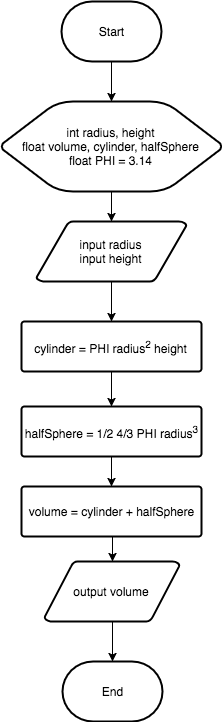

# Quiz

1.  Write program that calculate total
   volume of cylinder and half sphere based on flowchart below!

   > **Note**: Format output with precision of 4 digits behind comma. Example:
   > 3.3333333 become 3.3333

  

2. Mr. Krab, a businessman that have restaurant. He gives salary to the
   employees every month. Employees get basic pay and allowance. Employees have
   responsibility to pay tax of 10 percent from basic pay. The employee's salary
   was cut by IDR 200.000 for health insurance. Please write the program to help
   Mr. Krab calculate employee salary!
