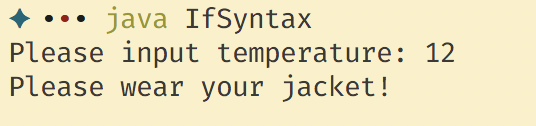
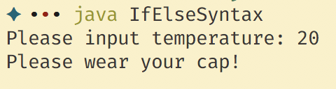
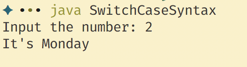
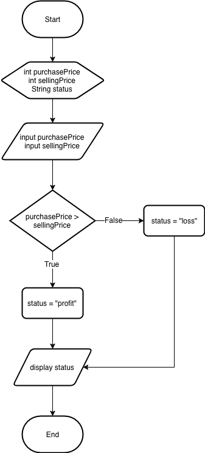
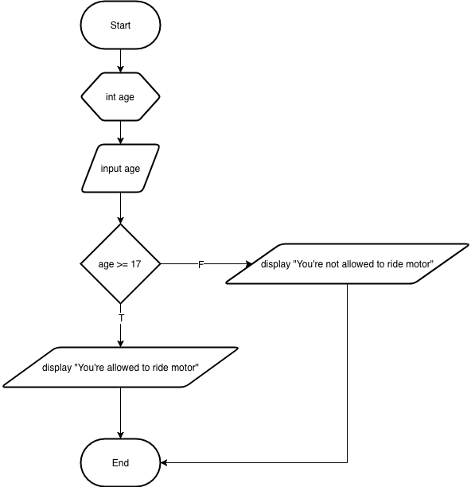

# Jobsheet 5 - Conditional Syntax 1

### Operator

Operator is special symbols that used to operate data (operand). Kind of
operator is **Assignment Operator**, **Arithmatic Operator**, **Relational
Operator** and **Logical Operator**.

#### Assignment Operator

| Operator | Description                                                                          | Example                            |
| ---      | ---                                                                                  | ---                                |
| `=`      | Set value from right operand into left operand                                       | `C = A` means set A's value into C |
| `+=`     | Add left operand with right operand and set value into left operand                  | `C += A` equals `C = C + A`        |
| `-=`     | Subtract left operand with right operand and set value into left operand             | `C -= A` equals `C = C - A`        |
| `*=`     | Multiply left operand with right operand and set value into left operand             | `C *= A` equals `C = C * A`        |
| `/=`     | Divide left operand with right operand and set value into left operand               | `C /= A` equals `C = C / A`        |
| `%=`     | Run modulo operation left operand with right operand and set value into left operand | `C %= A` equals `C = C % A`        |

#### Arithmatic Operator (Binary and Unary)

| Operator | Description       |
| ---      | ---               |
| `+`      | Plus operator     |
| `-`      | Subtract operator |
| `*`      | Multiply operator |
| `/`      | Divide operator   |
| `%`      | Modulo operator   |


| Operator | Description                     |
| ---      | ---                             |
| `++`     | increase one value (increment)  |
| `--`     | decrease one value (decreement) |

#### Relational Operator

| Operator | Description                                             |
| ---      | ---                                                     |
| `==`     | equals operator, return true if the condition is equals |
| `!=`     | not equals operator                                     |
| `>`      | greater than operator                                   |
| `<`      | less than operator                                      |
| `>=`     | greater than or equals operator                         |
| `<=`     | less than or equals operator                            |


#### Logical Operator

| Operator                  | Description  |
| ---                       | ---          |
| `&&`                      | And operator |
| <code>&#124;&#124;</code> | Or operator  |
| `!`                       | Not operator |

### Basic Conditional Syntax

#### `if`

```
if (condition) {
  statement;
  statement;
}
```

**Example**

```java
import java.util.Scanner;

public class IfSyntax {
  public static void main(String[] args) {
    Scanner sc = new Scanner(System.in);
    System.out.print("Please input temperature: ");
    int temperature = sc.nextInt();

    if (temperature < 16) {
      System.out.println("Please wear your jacket!");
    }
  }
}
```

**Output**



#### `if-else`

```
if (condition) {
  statement;
  statement;
} else {
  statement;
}
```

**Example**

```java
import java.util.Scanner;

public class IfElseSyntax {
	public static void main(String args[]) {
		Scanner sc = new Scanner(System.in);
		System.out.print("Please input temperature: ");
		int temperature = sc.nextInt();

		if (temperature < 16) {
			System.out.println("Please wear your jacket!");
		} else {
			System.out.println("Please wear your cap!");
		}
	}
}
```

**Output**



#### `switch-case`

```
switch (condition) {
  case constant-1:
    statement;
    break;
  case constant-2:
    statement-2;
    break;
  ...
  ...
  case constant-n:
    statement-n;
    break;
  default:
    statement;
}
```

**Example**

```java
import java.util.Scanner;

public class SwitchCaseSyntax {
	public static void main(String args[]) {
		Scanner sc = new Scanner(System.in);
		System.out.print("Input the number: ");
		int number = sc.nextInt();

		switch (number) {
			case 1:
				System.out.println("It's Sunday");
				break;
			case 2:
				System.out.println("It's Monday");
				break;
			case 3:
				System.out.println("It's Tuesday");
				break;
			case 4:
				System.out.println("It's Wednesday");
				break;
			case 5:
				System.out.println("It's Thursday");
				break;
			case 6:
				System.out.println("It's Friday");
				break;
			case 7:
				System.out.println("It's Saturday");
				break;
			default:
				System.out.println("Your number is invalid!");
		}
	}
}
```

**Output**



### Multiple Conditional Syntax


### Experiment

#### Experiment 1

- Open your text editor (Sublime, Notepad++, VSCode or Atom)
- Create new file then give filename `Number.java`
- Create class `Number`
- Write `main()` function java
- Add external library `Scanner`

  ```java
  import java.util.Scanner;
  ```

- Declare variable with name `scanner` and datatype is `Scanner`

  ```java
  Scanner scanner = new Scanner(System.in);
  ```

- Create a variable with datatype integer, then give name `number`.

  ```java
  int number;
  ```

- Then insert code below to receive input from user.

  ```java
  System.out.print("Please input the number: ");
  number = scanner.nextInt();
  ```
- Create conditional structure to check the number is even or odd. We can use
  the remaining values from modulus by 2.

  ```java
  if (number % 2 == 0) {
    System.out.println("Number " + number + " is even.");
  } else {
    System.out.println("Number " + number + " is odd.");
  }
  ```
- Compile the java file using `javac` command, then execute the program.

#### Experiment 2

- Open text editor (sublime, VSCode, Notepad++ or Atom)
- See the picture below!

  

- Create filename with name `ProfitOrLoss.java`
- Then create class with name `ProfitOrLoss`
- Write basic structure `main()` function
- Add import library `Scanner`
  ```java
  import java.util.Scanner;
  ```
- Declare variable `sc` with datatype `Scanner`
  ```java
  Scanner sc = new Scanner(System.in);
  ```
- Create two variables with datatype `int` and a variable `String`.

  ```java
  int purchasePrice;
  int sellingPrice;
  String status = null;
  ```

- Insert code below to ask user input.

  ```java
  System.out.print("Please input the purchase price: ");
  purchasePrice = sc.nextInt();
  System.out.print("Please input the selling price: ");
  sellingPrice = sc.nextInt();
  ```
- Create basic structure conditional to check profit or loss.

  ```java
  if (sellingPrice > purchasePrice) {
    status = "Profit";
  } else {
    status = "Loss";
  }
  ```

- Add code below to display the output of status

  ```java
  System.out.println("You're " + status);
  ```

- Compile using `javac` and then run the program!

#### Experiment 3

- Open text editor (Sublime, VSCode, Notepad++ or Atom)
- Create new filename `Calculator.java`
- Create classname `Calculator`
- Write basic `main()` function
- Add import library `Scanner`
  ```java
  import java.util.Scanner;
  ```
- Declare `sc` as `Scanner`
- Create three variables with data type double and a variable with data type
 char. Then give the names as `number1`, `number2`, `result` and `operator`.

 ```java
 double number1, number2, number3;
 char operator;
 ```
- Add code below to ask user input.
  ```java
  System.out.print("Input first number: ");
  number1 = sc.nextDouble();
  System.out.print("Input second number: ");
  number2 = sc.nextDouble();
  System.out.print("Input operator (+ - * /): ");
  operator = sc.next().charAt(0);
  ```
- Create `switch-case` to calculate operation.

  ```java
  switch (operator) {
    case '+':
      result = number1 + number2;
      System.out.println(number1 + " + " + number2 + " = " + result);
      break;
    case '-':
      result = number1 - number2;
      System.out.println(number1 + " - " + number2 + " = " + result);
      break;
    case '*':
      result = number1 * number2;
      System.out.println(number1 + " * " + number2 + " = " + result);
      break;
    case '/':
      result = number1 / number2;
      System.out.println(number1 + " / " + number2 + " = " + result);
      break;
    default:
      System.out.println("Wrong operator!");
  }
  ```
- Compile and execute the program!

### Questions

1. Explain the purpose of keyword below!
  - `else`
  - `break`
  - `default`

2. Explain the purpose of syntax below:
  - `operator = sc.next().charAt(0);`
  - `if (number % 2 == 0)`

3. In the experiment 3 add feature to calculate remaining value using modulus
   operator `%`!

### Assignment

1. Create the program that needs input two integer number, then display the max
   number into the screen!

2. Please see the picture of flowchart below!

  

  Create the program based on the flowchart!

3. Financial officer calculate salary of employees every end of month. Total
   salary based on basic pay, meal allowance, and transportation allowance.

   `Total salary = basic pay + meal allowance + transportation allowance`

   If the total salary received is more than equal to IDR 1.500.000,00 then the
   salary is cut by tax 5%, while employees with total salary below IDR
   1.500.000,00 do not get tax.  Create the program to help financial officer
   calculate the total salary!

4. Create the program to determine placement class of student.
   If the grade of midterm exam more than 90 or the grade of final exam is
   equals 100, then the student go to class **A**, other than that go to class
   **B**. (**Input**: name of student, grade midterm exam and grade final
   exam!).
